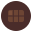

<p align="center">
  
</p>

<h1 align="center">Perugia: Città del Cioccolato</h1>

<p align="center">
  <strong>La Guida Indipendente</strong><br>
  Scopri Perugia attraverso la sua tradizione cioccolatiera
</p>

<p align="center">
  <a href="https://cittàdelcioccolato.it">Visita il sito</a>
  <br><br>
  <a href="LICENSE"></a>
</p>

---

## Cosa trovi

| Sezione | Descrizione |
|---------|-------------|
| **Itinerari** | Weekend goloso, giornata in città, percorsi per famiglie |
| **Luoghi** | Centro storico, musei del cioccolato, arte e cultura |
| **Esperienze** | Tour, laboratori e degustazioni prenotabili |
| **Guide PDF** | Contenuti scaricabili per pianificare il viaggio |

## Stack

- HTML5 / CSS3 / JavaScript vanilla
- Google Fonts (Open Sans, Playfair Display)
- Hosting: server proprietario

## Struttura del progetto

```
www/
├── index.html              # Homepage
├── itinerari.html          # Itinerari consigliati
├── centro-storico.html     # Guida al centro storico
├── museo-cioccolato.html   # Musei del cioccolato
├── arte-cultura.html       # Arte e cultura
├── guide-pdf.html          # Landing page guide PDF
├── chi-siamo.html          # About
├── privacy.html            # Privacy policy
├── cookie.html             # Cookie policy
├── termini.html            # Termini e condizioni
├── pubblicita.html         # Info pubblicità
├── send.php                # Form handler
├── robots.txt
├── sitemap.xml
└── assets/
    ├── style.css
    ├── cookie-consent.js
    └── favicon.*
```

---

<p align="center">
  <sub>© 2026 Perugia: Città del Cioccolato - La Guida Indipendente. Tutti i diritti riservati.</sub>
</p>
