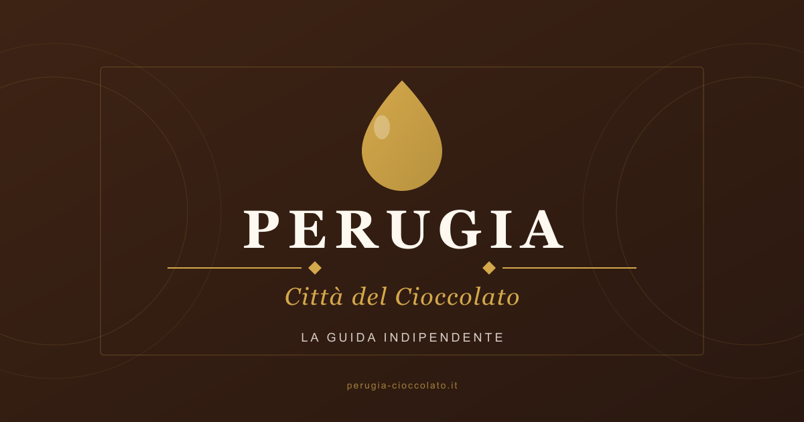

<p align="center">
  
</p>

<h1 align="center">Perugia: Città del Cioccolato</h1>

<p align="center">
  Guida editoriale indipendente dedicata a Perugia, alla sua tradizione cioccolatiera e al patrimonio culturale della città.
</p>

<p align="center">
  <a href="https://cittàdelcioccolato.it/">Sito online</a>
  ·
  <a href="https://cittàdelcioccolato.it/chi-siamo.html">Chi siamo</a>
  ·
  <a href="LICENSE">Licenza GPL-3.0</a>
</p>

<p align="center">
  
  
  
  
</p>

## Il progetto

Il sito raccoglie contenuti e strumenti per organizzare una visita a Perugia:

- guide al centro storico, ai musei del cioccolato e al patrimonio artistico;
- itinerari per weekend, visite giornaliere e famiglie;
- guide e approfondimenti consultabili gratuitamente online;
- rinvii informativi ai canali ufficiali dei soggetti citati.

Il progetto è indipendente e non rappresenta musei, aziende, eventi o istituzioni citati nelle pagine. Per orari, prezzi e prenotazioni vengono indicati, quando disponibili, i rispettivi siti ufficiali.
Il sito non vende prodotti o servizi, non ospita pubblicità e non utilizza collegamenti di affiliazione.

## Architettura

Non sono presenti framework, package manager, database o processo di build. Il progetto è composto da pagine HTML multipagina, un foglio di stile condiviso e JavaScript vanilla.

| Componente | Funzione |
| --- | --- |
| HTML5 | Contenuti e struttura delle pagine |
| CSS3 | Design responsive e componenti condivisi |
| JavaScript | Consenso cookie e caricamento condizionale di Google Analytics |
| Google Fonts | `Inter` e `Playfair Display` |

## Avvio locale

Per controllare layout, navigazione e contenuti:

```bash
python3 -m http.server 8000 --bind 127.0.0.1
```

## Configurazione

### Cookie e analytics

`assets/cookie-consent.js` gestisce il consenso nel browser tramite la chiave `cookie_consent` in `localStorage`. Google Analytics viene caricato solo dopo l'accettazione dell'utente.

L'identificativo GA4 è definito nella costante:

```js
const GA_ID = 'G-0GL8LJX691';
```

Se si cambia proprietà Analytics, occorre aggiornare questa costante e verificare che Cookie Policy e Privacy Policy restino coerenti.

## SEO e condivisione

Il repository include:

- title, description e URL canonical nelle pagine;
- metadati Open Graph e Twitter Card nelle principali landing page;
- immagini social in formato PNG e SVG;
- `robots.txt` e `sitemap.xml`;
- favicon SVG/PNG e icona Apple Touch;
- dominio internazionalizzato `cittàdelcioccolato.it`.

Quando si aggiunge o si rinomina una pagina pubblica, vanno aggiornati almeno navigazione, footer, `sitemap.xml`, canonical e collegamenti interni.

## Struttura del repository

```text
.
├── index.html                 # Homepage
├── centro-storico.html        # Guida al centro storico
├── museo-cioccolato.html      # Confronto tra i musei del cioccolato
├── arte-cultura.html          # Arte, musei e luoghi culturali
├── itinerari.html             # Itinerari di visita
├── guide-pdf.html             # Indice delle guide editoriali gratuite
├── chi-siamo.html             # Identità e indipendenza editoriale
├── privacy.html               # Privacy Policy
├── cookie.html                # Cookie Policy
├── termini.html               # Note legali
├── robots.txt
├── sitemap.xml
├── LICENSE
└── assets/
    ├── style.css              # Stili condivisi e layout responsive
    ├── cookie-consent.js      # Consenso cookie e caricamento GA4
    ├── favicon.svg
    ├── favicon-16.png
    ├── favicon-32.png
    ├── apple-touch-icon.png
    ├── logo-social.svg
    ├── logo-social.png
    ├── logo-social-share.svg
    └── logo-social-share.png
```

## Pubblicazione

Il deploy non richiede compilazione. È sufficiente pubblicare il contenuto del repository nella document root dell'hosting.

Prima della pubblicazione:

1. verificare i link ufficiali;
2. controllare canonical, metadati social e `sitemap.xml`;
3. verificare accettazione e rifiuto dei cookie in una sessione pulita;
4. controllare homepage e pagine principali su desktop e mobile;
5. aggiornare le date `lastmod` della sitemap per i contenuti modificati.

## Servizi esterni

Il sito utilizza o può collegarsi a servizi di terze parti:

- Google Fonts e Google Analytics;
- siti ufficiali di musei, eventi, strutture e istituzioni.

Disponibilità, contenuti e condizioni di questi servizi non sono controllati dal repository. I link esterni aperti in una nuova scheda devono mantenere attributi sicuri, come `rel="noopener"`.

## Licenza

Il progetto è distribuito secondo i termini della [GNU General Public License v3.0](LICENSE).
